# Week-5

### 要求三

INSERT INTO member  
    -> VALUES ('001', 'Apple', 'test', 'test', '100', '2022-01-01');

INSERT INTO member VALUES ('002', 'Bobby', 'test', 'test', '200', '2022-07-01'), 
    -> ('003', 'Calvin', 'test', 'test', '300', '2022-12-01'), 
    -> ('004', 'David', 'test', 'test', '400', '2021-02-01'), 
    -> ('005', 'Eric', 'test', 'test', '500', '2020-07-07');

SELECT * FROM member;

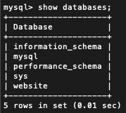

mysql> SELECT * FROM member ORDER BY time DESC;

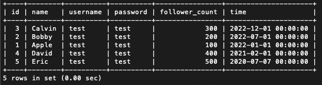

mysql> SELECT * FROM member ORDER BY time DESC LIMIT 1, 3;

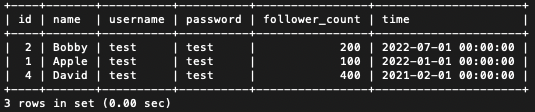

mysql> SELECT * FROM member where username = 'test';

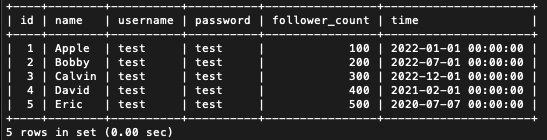

mysql> SELECT * FROM member where username = 'test' and password = 'test';

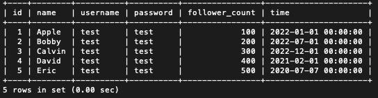

mysql> UPDATE member SET name = 'test2' where username = 'test';

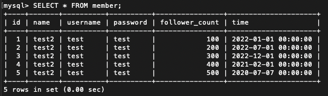

### 要求四

mysql> SELECT count(*) from member;

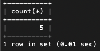

mysql> SELECT sum(follower_count) from member;

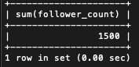

mysql> SELECT avg(follower_count) from member;

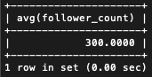

### 要求五

CREATE TABLE message (  
    -> id bigint AUTO_INCREMENT,  
    -> member_id bigint NOT NULL, 
    -> content varchar(255) NOT NULL, 
    -> like_count int unsigned NOT NULL DEFAULT 0, 
    -> time datetime NOT NULL DEFAULT NOW(), 
    -> PRIMARY KEY(id), 
    -> FOREIGN KEY (member_id) REFERENCES member(id) 
    -> );

INSERT INTO message (member_id, content, like_count)  
    -> VALUES (001, 'I am 001', 1);

INSERT INTO message (member_id, content, like_count) 
    -> VALUES (002, 'I am 002', 2), 
    -> (003, 'I am 003', 3), 
    -> (004, 'I am 004', 4), 
    -> (005, 'I am 005', 5);

SELECT mess.content, mem.name from message mess inner join member mem on mess.member_id = mem.id;

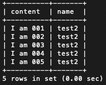

SELECT mess.content, mem.name from message mess inner join member mem on mess.member_id = mem.id where mem.username = 'test';

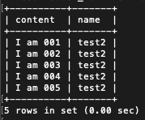

SELECT avg(mess.like_count) from message mess inner join member mem on mess.member_id = mem.id where mem.username = 'test';

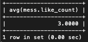
